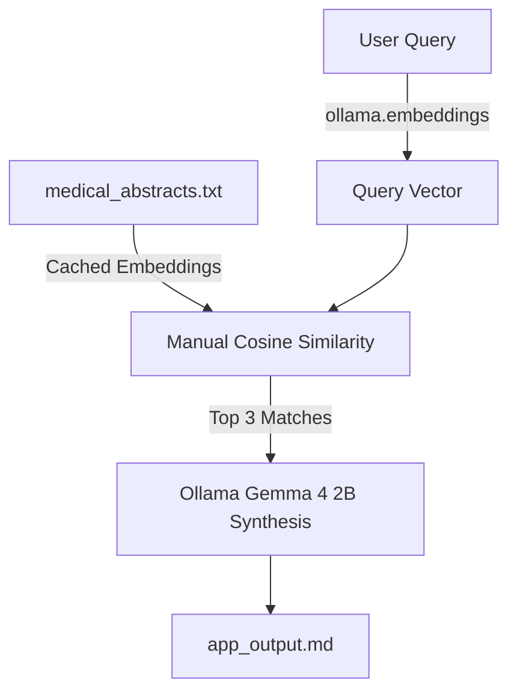

<div align="center">
  <a href="https://youtu.be/NP_TI6DJ98U">
    
  </a>
  <h3>📺 <a href="https://youtu.be/NP_TI6DJ98U">Watch the full tutorial on YouTube</a></h3>
</div>

# Liquid AI LFM 2.5 Released: Lightning Fast RAG in 10 Minutes (Local Setup)

A clean, localized, single-stage cross-lingual medical search and synthesis pipeline running **entirely locally on Ollama** using **Ollama's** native `nomic-embed-text` embedding model and **Google's Gemma 4 2B** LLM.

---

## 🚀 Quick Setup & Execution (Windows PowerShell)

Ensure you have **Python 3.12+** and **Ollama** installed on your system.

### 1. Install Dependencies
```powershell
pip install ollama
```

### 2. Configure Ollama Models

#### A. Register Local LFM 2.5 Models (GGUF)
To register the Liquid AI LFM 2.5 models in your local Ollama registry using the provided GGUFs and Modelfiles (for registration and model exploration):
```powershell
# Create the local Bi-Encoder embedding model
ollama create lfm2.5-embedding -f Modelfile.embedding

# Create the local ColBERT reranking model
ollama create lfm2.5-colbert -f Modelfile.colbert
```

#### B. Pull Required Ollama Models
Ensure you pull the native embedding model and the synthesis LLM:
```powershell
# Pull the native embedding model
ollama pull nomic-embed-text

# Pull Google's Gemma 4 2B model
ollama pull gemma4:e2b

# Verify the model list
ollama list
```
> **Note on Custom GGUFs**: If your environment raises a `status code: 500` loading error for `lfm2.5-embedding` (due to custom recurrent/attention layers not natively supported by Ollama/llama.cpp yet), `app.py` fallback uses the standard, fully-supported `nomic-embed-text` model.

### 3. Run the Application
```powershell
python app.py
```

---

## 🛠️ Pipeline Architecture



* **Embedding Retrieval:** Uses the local `nomic-embed-text` model via Ollama's embeddings API, calculating cosine similarity directly in Python with zero extra package dependencies.
* **Local Embedding Caching:** Automatically caches document embeddings to a local `embeddings_cache.json` file at startup for near-instant subsequent runs.
* **Gemma 4 Synthesis:** Queries `gemma4:e2b` to summarize the retrieved papers and appends the query details and synthesis directly to `app_output.md`.

---

## 💼 Enterprise Use Cases

* **Global Clinical Trial Mapping:** Automatically synthesize outcomes of clinical studies published in German, Spanish, French, and English without manual translation.
* **Real-time Pharmacovigilance Monitoring:** Streamline adverse event extraction from multilingual hospital reports into a centralized clinical dashboard.
* **Edge-Deployable Medical Search:** Run the entire RAG pipeline offline on consumer laptops or medical edge devices with minimal RAM constraints.
* **Medical Literature Synthesis:** Provide fast Q&A answers for doctors seeking drug interaction data across fragmented global research papers.
* **Cross-Border Patient History Retrieval:** Match patient files written in foreign languages to standardized medical terminologies locally.

---

## 🔮 Future Enhancements

* **Offline PDF/XML Parsing:** Add local document extractors (e.g., `pypdf`) to directly parse clinical PDF files dropped into the workspace.
* **Hybrid Lexical Search:** Combine dense retrieval with BM25 / lexical TF-IDF scoring for enhanced chemical formula matching.
* **Local Translation Caching:** Store translation pairs locally to speed up prompt delivery and optimize context window consumption.
* **Quantized Reranking:** Utilize quantized 4-bit ColBERT embeddings to reduce memory requirements under high-concurrency settings.
* **Retrieval-Augmented Medical Coding:** Auto-generate ICD-11 coding suggestions based on cross-referenced diagnostic reports.

---

## Keywords
`Liquid AI` `LFM 2.5` `Local RAG` `Ollama` `Gemma 4` `Medical Search` `Cross-Lingual Search` `Semantic Search` `Offline LLM` `Clinical Trial Synthesis`
